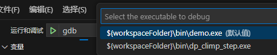
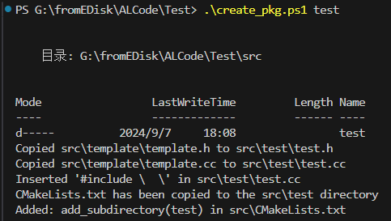
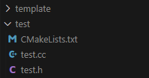

# code-test
Code test templates, which support compilation and debugging.

---
**revise**

1. "miDebuggerPath": "your/gdb/path/gdb.exe",

**config**

- VSCode(editor) + CMAKE(compile) + MinGW(debug) 

---

**more function**
1. Optional debugging items

    

2. Automate package generation

    In a recent commit, the create_pkg.ps1 and create_pkg.sh were designed when you perform create_pkg.ps1 <project_name> The script will automatically generates a standard project template.

    ```
    # for windows
    ./create_pkg.ps1 <project_name>
    # for linux
    bash create_pkg.sh <project_name>
    ```

    Once executed, you will see the project generated in the src directory.

    

    

    After that, all you have to do is build, and you're ready to do your own testing!

2. gtest support


3. ...
